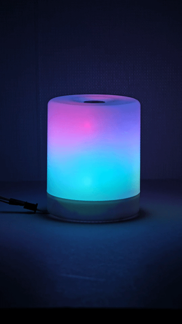

# AI 기반 감성 반응형 무드등 & AI 기반 이미지-음악 추천

**"이미지 한 장에 담긴 감성을 분석하여, 그에 맞는 음악과 빛으로 공간을 채우는 엣지 AI 기반의 ‘감성 반응형 AI 무드등’ 시스템”**



---

## 프로젝트 소개 (About The Project)

**적용 AI 모델**

- CLIP (Contrastive Language-Image Pre-training) - 이미지 감정 분류기 모델로 튜닝 및 훈련 진행 (EmoSet-118K 데이터셋 사용)
- BLIP (Bootstrapping Language-Image Pre-training) - 이미지 캡셔닝 모델
- CLAP (Contrastive Language-Audio Pre-training) - 감정 + 캡셔닝 텍스트로 음악 매칭 모델 (오디오 전체를 대상으로 하지 않고, ‘음악’을 대상으로 튜닝 진행)

### 기술 스택 (Tech Stack)


---

## 아키텍처 (Architecture)

### 전체 시스템 구성도


### AI 모델 파이프라인
(AI 모델 파이프라인 다이어그램을 여기에 추가할 수 있습니다.)

** trained on [another repository](여기에_모델_훈련_리포지토리_링크_삽입).**
> **중요:** "훈련된 모델은 별도의 리포지토리에서 관리됩니다" 라는 링크를 추가하여, 이 프로젝트가 "블랙박스" 모델을 그냥 가져다 쓴 것이 아니라, 모델 훈련 과정까지 모두 직접 수행했음을 명확하게 어필합니다.

---

## 환경 구축 및 시작 (Setting Development Environment & Getting Started)

이 프로젝트를 Jetson Orin Nano에서 직접 실행해보려면 아래의 과정을 따르세요.

### 사전 준비 (Prerequisites)

*   NVIDIA Jetson Orin Nano (JetPack 6.0 권장)
*   Arduino Uno & NeoPixel LED 스트립
*   필요한 모델 파일 및 데이터셋 (`clip_emotion_classifier.pt` 등)

### 설치 및 실행 (Installation & Execution)

1.  **리포지토리 복제:**
    ```bash
    git clone https://github.com/HunterYim/jetson-ai-image-to-music-with-light.git
    cd jetson-ai-image-to-music-with-light
    ```
2.  **아두이노 펌웨어 업로드:**
    `/arduino/mood_light_firmware/` 폴더의 `.ino` 파일을 Arduino IDE를 통해 업로드합니다.

3.  **Docker 환경 준비:**
    *   필요한 Docker 이미지를 다운로드합니다.
      ```bash
      # 이 부분은 실제 사용한 이미지 이름으로 수정해야 합니다.
      sudo docker pull dustynv/transformers:r36.3.0
      ```
4.  **스크립트 실행:**
    *   `jetson/start_docker.sh` 파일의 이미지 이름과 볼륨 마운트 경로를 자신의 환경에 맞게 수정한 뒤 실행합니다.
      ```bash
      cd jetson
      ./start_docker.sh
      ```
    *   컨테이너 내부에서 필요한 라이브러리를 설치하고, 메인 스크립트를 실행합니다.
      ```bash
      # Inside the container
      pip install pyserial pyserial
      pip install pyserial pygame
      python3 main.py
      ```

---

## 챌린지 및 해결 과정 (Challenges & Solutions)

이 프로젝트를 진행하며 마주했던 주요 기술적 난관과 해결 과정입니다. 더 자세한 내용은 **[Notion 포트폴리오](https://www.notion.so/AI-AI-2c25777a0a2d81f68e2dcc722cb16ee6?source=copy_link#2c25777a0a2d81a39b76ff4d46c841d1)**에서 확인하실 수 있습니다.

*   **Challenge #1: 개발 환경 구축 문제**
    *   **Solution:** Docker 컨테이너를 도입하고, 빌드 실패 문제를 `docker pull` 전략으로 전환하여 안정적인 개발 환경을 구축
*   **Challenge #2: Jetson 메모리 부족 문제**
    *   **Solution:** 스왑 메모리 추가, CPU 오프로딩의 전략으로 문제 해결
*   **Challenge #3: Jetson과 Arduino의 연결 문제**
    *   **Solution:** '투트랙 아키텍처'를 설계하고, `delay()`를 제거한 '논블로킹' 코드를 구현하여 안정적인 실시간 제어 달성

---
## 팀원 (Team)
*   **김재현:** 역할
*   **임헌터:** 역할
*   **양수영:** 역할
